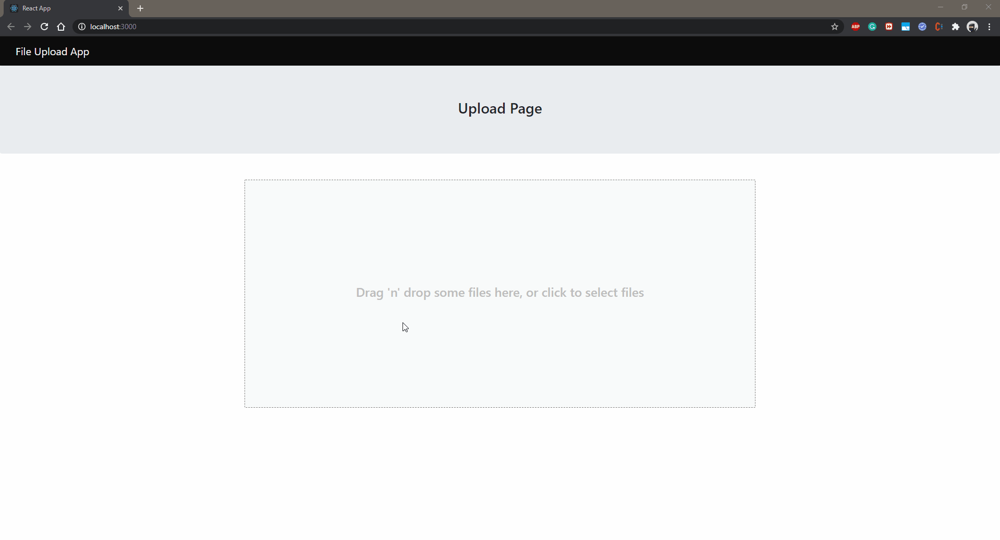
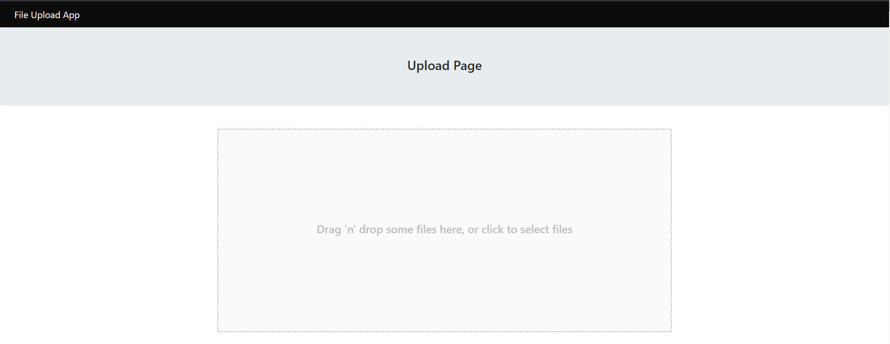
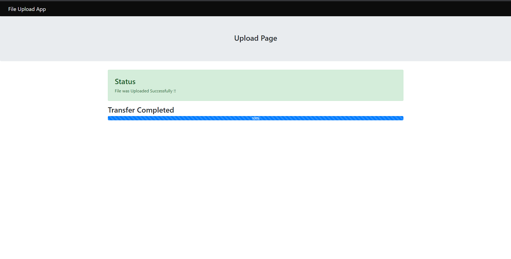
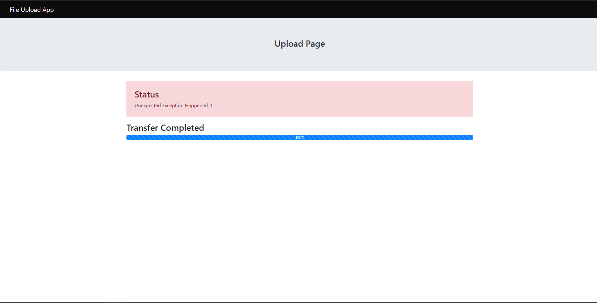

# Getting Started with Document Upload React App

Simple React App which upload drag 'n' drop file to given URL.

## Demo

## Prerequisites

Before running the App please navigate to .env file into root folder and update the values for `REACT_APP_EXTERNAL_SYSTEM_API_URL`&`REACT_APP_BASE64_AUTHORIZATION_HEADER`\
Above values are used to upload file to external system.

To Bypass CORS error, while running app locally install this extension available on Chrome web store [Allow CORS: Access-Control-Allow-Origin](https://chrome.google.com/webstore/detail/allow-cors-access-control/lhobafahddgcelffkeicbaginigeejlf)
## How to Run

In the project directory, you can run:

### `npm install`

To install all the dependencies available in React App.

### `npm run`

To Run the app in the development mode.\
By default project will run into [http://localhost:3000](http://localhost:3000) to view it in the browser.

## Screenshot

* Homepage
  
  
  
* On Success
  
  

* On Exception

  
